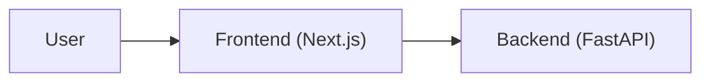
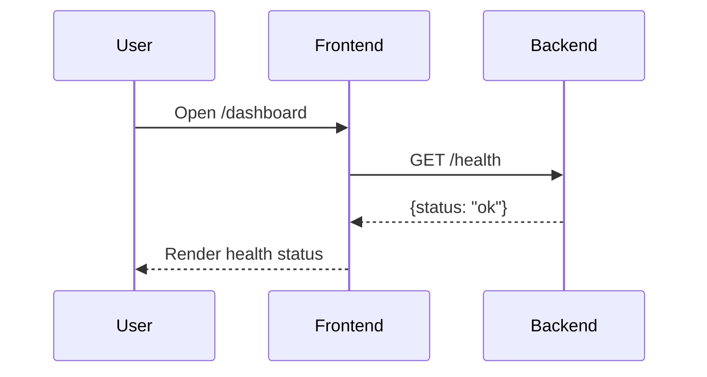

```mermaid
flowchart LR
  %% Phase 0 - System Overview
  U[User] --> FE["Frontend (Next.js)"]
  FE --> BE["Backend (FastAPI)"]
```

```mermaid
flowchart LR
  %% Phase 0 - Data Flow
  U[User] -->|HTTP| FE[Frontend]
  FE -->|HTTP /health| BE[Backend]
  BE -->|JSON {status}| FE
```

```mermaid
sequenceDiagram
  %% Phase 0 - Health Check
  participant U as User
  participant FE as Frontend
  participant BE as Backend
  U->>FE: Open /dashboard
  FE->>BE: GET /health
  BE-->>FE: {status: "ok"}
  FE-->>U: Render health status
```
