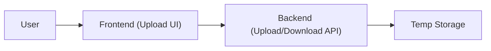
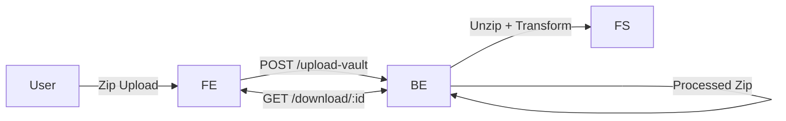
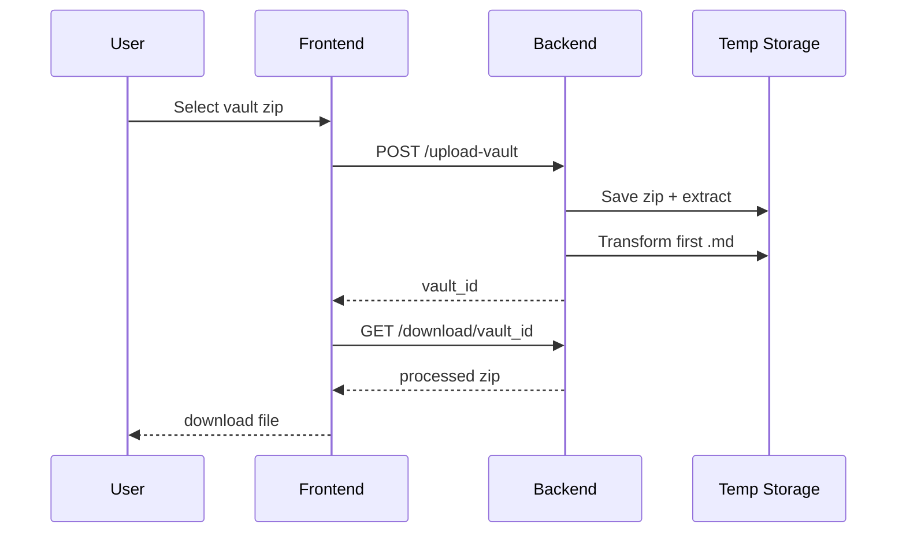

```mermaid
flowchart LR
  %% Phase 1 - System Overview
  U[User] --> FE["Frontend (Upload UI)"]
  FE --> BE["Backend (Upload/Download API)"]
  BE --> FS[Temp Storage]
```

```mermaid
flowchart LR
  %% Phase 1 - Data Flow
  U[User] -->|Zip Upload| FE
  FE -->|POST /upload-vault| BE
  BE -->|Unzip + Transform| FS
  BE -->|Processed Zip| BE
  FE <-->|GET /download/:id| BE
```

```mermaid
sequenceDiagram
  %% Phase 1 - Upload/Download
  participant U as User
  participant FE as Frontend
  participant BE as Backend
  participant FS as Temp Storage
  U->>FE: Select vault zip
  FE->>BE: POST /upload-vault
  BE->>FS: Save zip + extract
  BE->>FS: Transform first .md
  BE-->>FE: vault_id
  FE->>BE: GET /download/vault_id
  BE-->>FE: processed zip
  FE-->>U: download file
```
