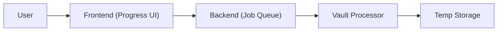
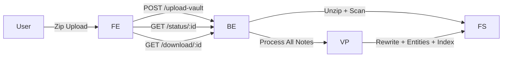
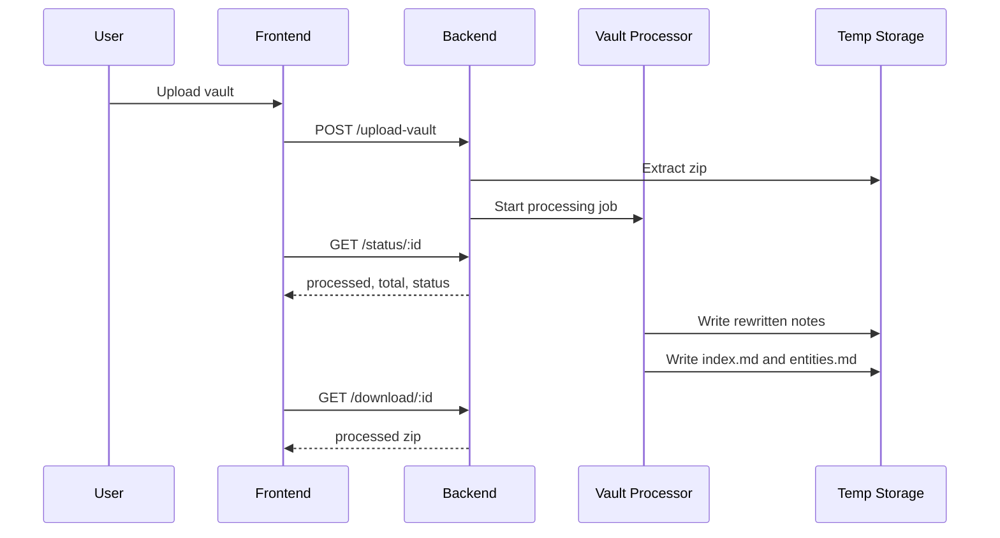

```mermaid
flowchart LR
  %% Phase 2 - System Overview
  U[User] --> FE["Frontend (Progress UI)"]
  FE --> BE["Backend (Job Queue)"]
  BE --> VP[Vault Processor]
  VP --> FS[Temp Storage]
```

```mermaid
flowchart LR
  %% Phase 2 - Data Flow
  U[User] -->|Zip Upload| FE
  FE -->|POST /upload-vault| BE
  BE -->|Unzip + Scan| FS
  BE -->|Process All Notes| VP
  VP -->|Rewrite + Entities + Index| FS
  FE -->|GET /status/:id| BE
  FE -->|GET /download/:id| BE
```

```mermaid
sequenceDiagram
  %% Phase 2 - Full Processing
  participant U as User
  participant FE as Frontend
  participant BE as Backend
  participant VP as Vault Processor
  participant FS as Temp Storage
  U->>FE: Upload vault
  FE->>BE: POST /upload-vault
  BE->>FS: Extract zip
  BE->>VP: Start processing job
  FE->>BE: GET /status/:id
  BE-->>FE: processed, total, status
  VP->>FS: Write rewritten notes
  VP->>FS: Write index.md and entities.md
  FE->>BE: GET /download/:id
  BE-->>FE: processed zip
```
