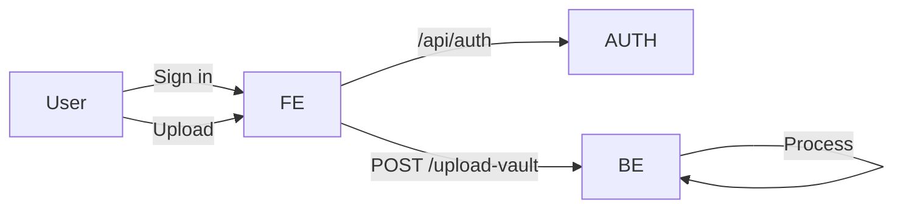
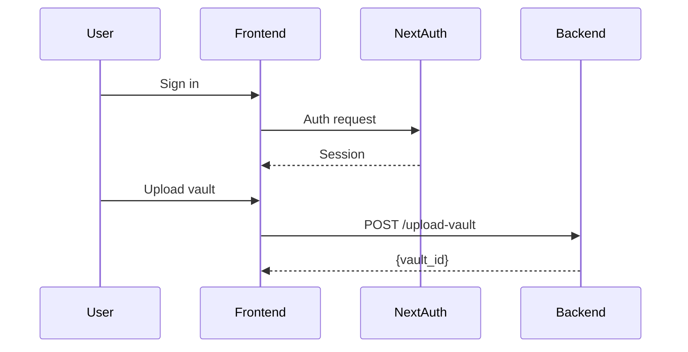

```mermaid
flowchart LR
  %% Phase 3 - System Overview
  U[User] --> FE[Frontend (Auth + Upload)]
  FE --> AUTH[NextAuth]
  FE --> BE[Backend (Limits + Security)]
  BE --> STR[Stripe Webhook Stub]
```




