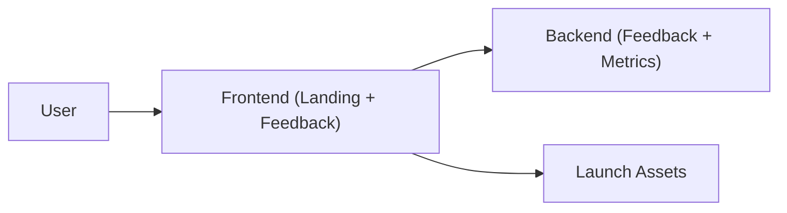
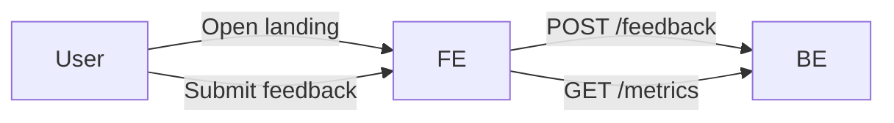
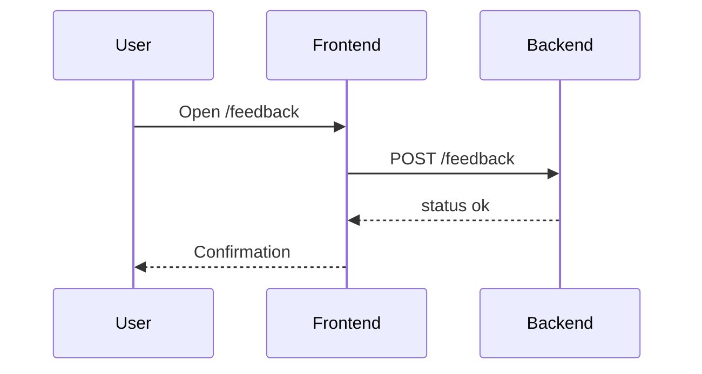

```mermaid
flowchart LR
  %% Phase 4 - System Overview
  U[User] --> FE["Frontend (Landing + Feedback)"]
  FE --> BE["Backend (Feedback + Metrics)"]
  FE --> ASSET[Launch Assets]
```

```mermaid
flowchart LR
  %% Phase 4 - Data Flow
  U[User] -->|Open landing| FE
  U[User] -->|Submit feedback| FE
  FE -->|POST /feedback| BE
  FE -->|GET /metrics| BE
```

```mermaid
sequenceDiagram
  %% Phase 4 - Feedback Flow
  participant U as User
  participant FE as Frontend
  participant BE as Backend
  U->>FE: Open /feedback
  FE->>BE: POST /feedback
  BE-->>FE: status ok
  FE-->>U: Confirmation
```
